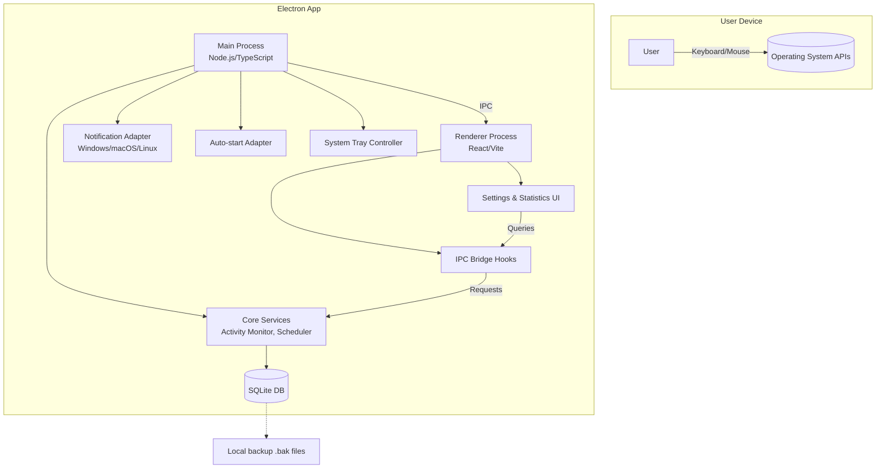

# Báo thức Fullstack Architecture Document

## Introduction

This document outlines the complete fullstack architecture for **Báo thức**, including backend systems, frontend implementation, and their integration. It serves as the single source of truth for AI-driven development, ensuring consistency across the entire technology stack.

This unified approach combines what would traditionally be separate backend and frontend architecture documents, streamlining the development process for modern fullstack applications where these concerns are increasingly intertwined.

### Starter Template or Existing Project

N/A – Greenfield desktop project. No starter template is mandated. We will bootstrap using Electron Forge (for packaging/build) with Vite + React UI scaffold plus shared Node/TypeScript utilities. The repository will be initialized from scratch following the structure defined in this document.

### Change Log

| Date       | Version | Description                     | Author            |
|------------|---------|---------------------------------|-------------------|
| 2025-11-26 | 1.0     | Initial architecture definition | Architect (Winston) |

## High Level Architecture

### Technical Summary

The Báo thức application is a cross-platform desktop client built with **Electron + Vite + React** using **TypeScript** end-to-end. Electron’s **Main Process** hosts the background monitoring service (tracking keyboard/mouse activity, scheduling reminders, orchestrating notifications) while the **Renderer Process** delivers the Settings/Statistics UI. A shared **Core Service Layer** manages business logic, configuration, and SQLite persistence via better-sqlite3. Platform-specific adapters encapsulate OS APIs for activity detection, notifications, auto-start, and system tray integration. Packaging and auto-updates are handled via Electron Forge/Builder with signed installers per OS. All functionality runs locally; no remote backend or cloud infrastructure is required for MVP, simplifying deployment and protecting user privacy.

### Platform and Infrastructure Choice

**Evaluated Options**

1. **Electron + Local SQLite (Chosen)**
   - Pros: Mature ecosystem, rich APIs, cross-platform UI with React, large community, straightforward packaging.
   - Cons: Larger runtime footprint (~100 MB), higher memory usage vs native.
2. **Tauri + Rust Backend**
   - Pros: Much smaller binaries, lower memory usage, Rust safety.
   - Cons: Younger ecosystem, fewer ready-made integrations, steeper learning curve.
3. **Flutter Desktop**
   - Pros: Native-feel UI, single codebase for desktop/mobile, strong widget library.
   - Cons: Less direct access to low-level OS hooks (needs plugins), heavier build tooling.

**Recommendation & Confirmation:** Electron + SQLite remains the fastest path for MVP with minimal risk. We document Tauri migration considerations for future optimization.

```
Platform: Local Desktop (Electron)
Key Services: Electron Main/Renderer, better-sqlite3, OS notification APIs, auto-launch services
Deployment Host and Regions: N/A (distributed installers via GitHub Releases or company portal)
```

### Repository Structure

```
Structure: Monorepo (pnpm workspaces)
Monorepo Tool: pnpm + Turborepo (optional)
Package Organization:
  /apps/desktop          -> Electron app (main + renderer via Vite/React)
  /packages/core         -> Shared domain logic, activity monitoring, scheduling
  /packages/ui           -> Reusable UI components, theming, design tokens
  /packages/platform     -> OS-specific adapters (Windows/macOS/Linux)
  /packages/config       -> Shared config schemas, zod validators
```

### High Level Architecture Diagram



### Architectural Patterns

- **Electron BFF Pattern:** Main Process acts as a local back-end-for-frontend, exposing IPC channels to renderer. _Rationale:_ Clear separation between privileged OS operations and UI.
- **Domain-Service Layering:** Core business logic (timers, stats) lives in shared services, decoupled from UI and OS adapters. _Rationale:_ Facilitates testing and future migration to other shells (Tauri, mobile).
- **Repository Pattern for Persistence:** SQLite interactions abstracted via repositories in `packages/core`. _Rationale:_ Simplifies schema evolution and unit testing.
- **Adapter Pattern for OS APIs:** Per-platform adapters hide OS-specific code. _Rationale:_ Keeps main logic platform-agnostic.
- **Event-Driven Scheduling:** Activity monitor publishes events to scheduler/reminder engine. _Rationale:_ Extensible for future analytics or remote sync.

## Tech Stack

| Layer                    | Technology / Version                         | Notes                                                                 |
|--------------------------|----------------------------------------------|-----------------------------------------------------------------------|
| Language                 | TypeScript 5.x                               | Strict type checking across main + renderer                           |
| Runtime                  | Node.js 20 LTS                               | Electron bundle                                                       |
| Desktop Shell            | Electron 30.x (with Electron Forge)          | Cross-platform packaging                                              |
| Frontend UI              | React 18 + Vite + Tailwind (or CSS Modules)  | Minimal, responsive desktop UI                                       |
| State Mgmt               | Zustand (settings) + React Query (stats)      | Lightweight, predictable state                                       |
| Styling/Design System    | Tailwind + Radix UI primitives                | Fast iteration, accessible defaults                                  |
| Data Storage             | SQLite (better-sqlite3)                       | Local persistent store                                                |
| Background Scheduling    | node-cron / custom scheduler                  | Drives reminders                                                      |
| IPC Layer                | Electron IPC + custom channel wrappers       | Type-safe communication                                               |
| Notifications            | Windows Toast API, macOS NSUserNotification   | via electron-notifications or custom native modules                   |
| Activity Detection       | Windows GetLastInputInfo, macOS IOKit, Linux X11 | Encapsulated per-platform modules                                 |
| Auto-launch              | electron-auto-launch / custom plist writer    | Enable run on startup                                                 |
| Packaging                | Electron Forge + electron-builder             | Generates dmg/exe/AppImage                                            |
| Testing (Unit)           | Vitest + Testing Library                      | Main + renderer coverage                                              |
| Testing (E2E/UI)         | Playwright                                   | Smoke tests for UI flows                                              |
| Linting/Formatting       | ESLint (flat config) + Prettier               | Enforced via Husky pre-commit                                         |
| Logging/Observability    | pino (rotating logs) + Sentry (optional)      | Local log files + crash reporting                                     |
| CI/CD                    | GitHub Actions                               | Build/test, artifact publish                                          |

## Environment Strategy

| Environment | Purpose                         | Distribution / Differences                                           |
|-------------|---------------------------------|----------------------------------------------------------------------|
| `dev`       | Developer machines              | Run via `pnpm dev`, hot reload, mocked activity inputs               |
| `qa`        | Internal testing builds         | Signed but not auto-updating, debug logging enabled                  |
| `prod`      | Public releases                 | Fully signed installers, auto-update enabled, release notes included |

Environment variables are managed via `.env` per workspace with `dotenv-safe`. Sensitive values (signing cert paths, Sentry DSN) stored in GitHub Actions secrets.

## Module Architecture

```
apps/
  desktop/
    main/               -> Electron main process
      main.ts           -> Bootstraps app, registers IPC, tray, windows
      preload.ts        -> Exposes safe API to renderer
      services/
        activity/       -> Platform adapters
        scheduler/      -> Reminder engine
        notifications/  -> OS notification adapters
        persistence/    -> Repositories (settings, stats)
        logging/        -> pino logger
    renderer/
      src/
        App.tsx
        features/
          settings/
          statistics/
          reminders/
        components/
        hooks/
        store/
packages/
  core/                 -> Domain logic (TimerService, StatsService)
  platform/             -> OS-specific utilities
  ui/                   -> Shared UI kit + theming
  config/               -> zod schemas, configuration loaders
```

## Data Architecture

### SQLite Schema (Local)

| Table            | Columns                                                                                                   | Notes                                     |
|------------------|-----------------------------------------------------------------------------------------------------------|-------------------------------------------|
| `settings`       | `key TEXT PRIMARY KEY`, `value TEXT`, `updated_at INTEGER`                                                 | Stores JSON serialized preferences        |
| `usage_sessions` | `id INTEGER PK`, `start_ts INTEGER`, `end_ts INTEGER`, `duration_ms INTEGER`, `platform TEXT`              | Logged active sessions                    |
| `reminders`      | `id INTEGER PK`, `fired_at INTEGER`, `type TEXT`, `response TEXT`                                          | Tracks reminders + user response          |
| `stats_daily`    | `date TEXT PK`, `break_count INTEGER`, `usage_minutes INTEGER`, `longest_session_minutes INTEGER`         | Aggregated stats                          |
| `migrations`     | `id INTEGER PK`, `name TEXT UNIQUE`, `applied_at INTEGER`                                                  | Migration tracking                        |

SQLite is accessed through a repository layer with zod-based validation. All reads/writes happen on the main process to avoid multi-process contention.

## Activity Detection & Reminder Engine

1. **Activity Monitor**
   - Polls OS APIs every 5s (configurable).
   - Emits `ACTIVE`/`IDLE` events to Scheduler.
   - Idle threshold default 5 minutes resets the work session.
2. **Scheduler**
   - Maintains per-user timer (default 45 min).
   - On `ACTIVE`, increments elapsed time; on `IDLE`, resets.
   - When elapsed ≥ threshold, triggers Reminder pipeline.
3. **Reminder Pipeline**
   - Determines user-selected channels (popup, notification, sound).
   - Sends message via IPC to renderer for popup; uses adapter for system notifications; plays audio via electron-sound module.
   - Logs reminder event and resets timer once user acknowledges or auto-dismisses.

## IPC & API Contract

All renderer-to-main communication occurs via typed IPC channels exposed through `contextBridge` in `preload.ts`. Example channels:

| Channel                 | Direction | Payload                                 | Purpose                                   |
|-------------------------|-----------|-----------------------------------------|-------------------------------------------|
| `settings:get`          | Renderer → Main | `{}`                                 | Fetch current settings                     |
| `settings:update`       | Renderer → Main | `{ key: string, value: any }`         | Persist a setting                          |
| `stats:get`             | Renderer → Main | `{ range: 'today'|'week' }`           | Retrieve aggregated stats                  |
| `reminder:test`         | Renderer → Main | `{ type: 'popup'|'notification'|'sound' }` | Trigger sample reminder for preview |
| `app:state`             | Main → Renderer | `{ status: 'active'|'paused', countdownMs }` | UI displays state                     |

IPC handlers validate payloads via zod schemas before executing core services.

## Security Considerations

- **Context Isolation:** Enabled; renderer has no direct Node access. All OS calls go through preload API.
- **Content Security Policy:** Enforced to prevent remote code execution (no remote resources).
- **Code Signing:** Required for macOS notarization and Windows SmartScreen trust.
- **Auto-update Integrity:** Use code-signed update servers (GitHub Releases + electron-updater with SHA512).
- **Data Privacy:** All data stored locally, optionally encrypted at rest using AES if future requirements demand.
- **Crash Reporting:** Sentry with scrubbed PII (only telemetry).

## Observability & Logging

- `pino` logger writes rotating log files per OS: `%APPDATA%/BaoThuc/logs`.
- Log levels: debug (dev), info (prod), warn/error.
- Crash reports optionally sent to Sentry with DSN configured via env.
- Built-in diagnostics view accessible via hidden shortcut for support.

## Deployment Strategy

1. **Build Pipeline**
   - GitHub Actions on `main`:
     - `pnpm install`
     - `pnpm lint && pnpm test && pnpm build`
     - Electron Forge package per OS
     - Draft release with artifacts
2. **Distribution**
   - GitHub Releases (.exe, .dmg, .AppImage) + auto-update feed (electron-updater).
   - Optional Microsoft Store / Mac App Store submission later (requires sandbox adjustments).
3. **Auto Updates**
   - electron-updater polling release feed, verifying signatures.
   - UI notifications for updates with release notes.

## Migration Considerations (Tauri Path)

Documented for future optimization:
- Replace Electron main with Rust backend, keep React frontend.
- Use `tauri-plugin-autostart`, `tauri-plugin-notification`.
- Swap better-sqlite3 with `sqlx` or `sea-orm`.
- Maintains same domain services & IPC contracts (converted to Tauri commands).

## Risks & Mitigations

| Risk                                   | Impact | Mitigation                                                         |
|----------------------------------------|--------|---------------------------------------------------------------------|
| High memory usage (Electron footprint) | Medium | Optimize renderer, lazy-load charts, consider Tauri later           |
| OS-specific API differences            | Medium | Abstract via adapters, add automated ci smoke tests per platform    |
| Notification permissions denied        | Low    | Detect and surface instructions to enable notifications             |
| Auto-start blocked by security policy  | Low    | Provide manual instructions, fallback to user-enabled option        |
| SQLite corruption on abrupt shutdown   | Low    | Use WAL mode, regular backups `.bak`                                |

## Implementation Roadmap Alignment

The architecture aligns with PRD epics:
- **Epic 1 (Foundation):** Repo setup, activity monitor, notification base all defined above.
- **Epic 2 (Reminders):** Scheduler & adapters detail, ready for story breakdown.
- **Epic 3 (Settings UI):** Renderer structure, IPC contracts, component design defined.
- **Epic 4 (Statistics):** Data schema + repository pattern ensure story clarity.

## Next Steps for Developers

1. Scaffold monorepo (`pnpm dlx create-electron-app --template=webpack+ts` or custom) per structure above.
2. Implement `packages/core` services first (ActivityMonitor, ReminderScheduler, SettingsRepository).
3. Build platform adapters incrementally (start with Windows/macOS).
4. Wire IPC contracts and preload API with zod validation.
5. Implement renderer features per Front-end Spec.
6. Configure CI/CD pipeline and signing certificates.

---

**Document Status:** Draft v1.0  
**Created:** 2025-11-26  
**Last Updated:** 2025-11-26  
**Author:** Architect (Winston)

