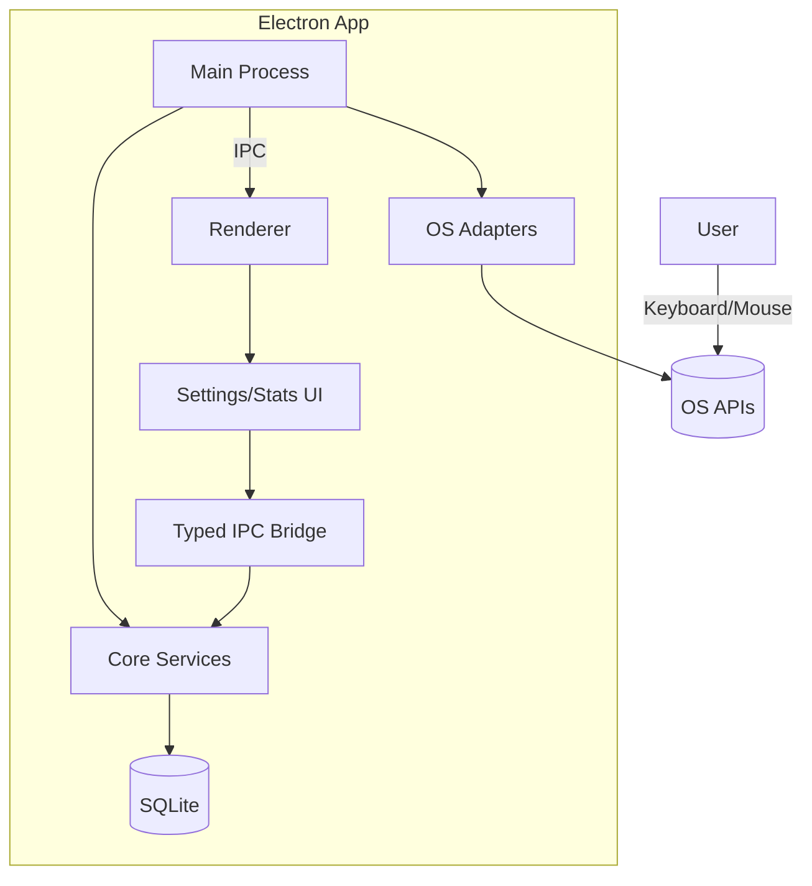

# Architecture Shard · High-Level Overview

Nguồn: `docs/architecture.md`

## Technical Summary

Ứng dụng desktop cross-platform xây bằng **Electron + Vite + React** (TypeScript). Electron **Main Process** chứa background monitoring (activity detection, scheduler, notifications) và quản lý SQLite persistence. **Renderer Process** hiển thị Settings/Statistics UI. Core service layer chia sẻ business logic, trong khi adapter per-platform wrap OS APIs (activity, notifications, auto-start, system tray). Packaging sử dụng Electron Forge/Builder với auto-update; toàn bộ chạy local để đảm bảo quyền riêng tư.

## Platform Choice

- **Option 1 – Electron + SQLite (Chọn):** Maturity cao, ecosystem lớn, packaging dễ, access đầy đủ OS APIs.
- **Option 2 – Tauri:** Binaries nhỏ, hiệu năng cao nhưng ecosystem nhỏ hơn.
- **Option 3 – Flutter Desktop:** UI native nhưng khó truy cập low-level API.

**Kết luận:** Electron + SQLite là con đường nhanh nhất cho MVP; tài liệu hóa phương án migrate sang Tauri trong tương lai.

## Repository Structure

```
apps/
  desktop/ (Electron main + renderer)
packages/
  core/       -> domain services (monitor, scheduler, repos)
  platform/   -> OS adapters
  ui/         -> shared UI kit
  config/     -> schema/config loader
```

## High-Level Diagram



