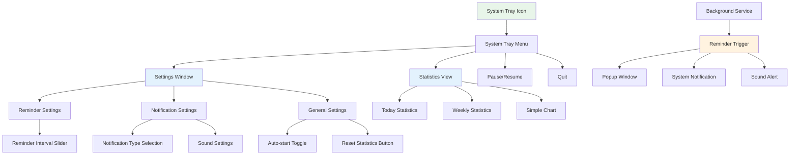
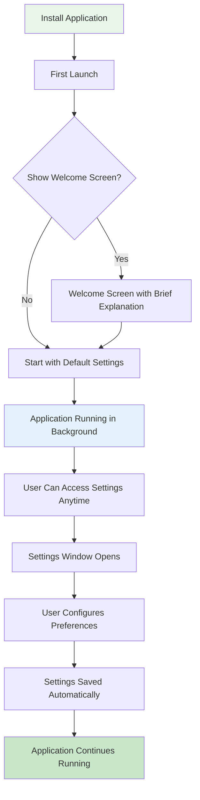
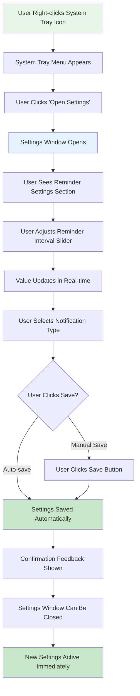
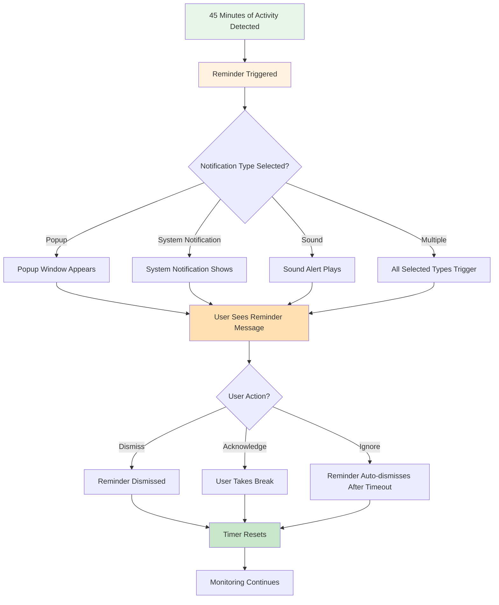
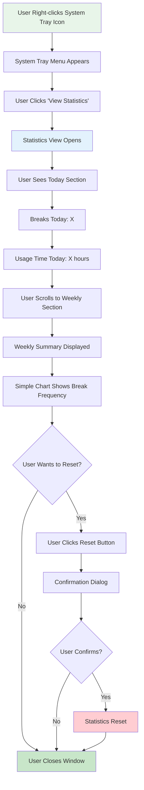
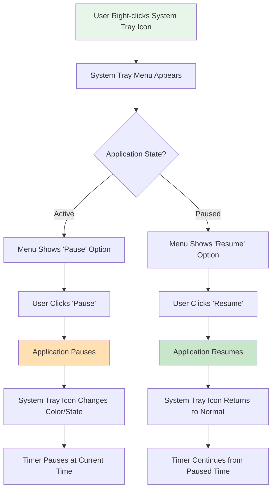

# Báo thức UI/UX Specification

## Introduction

This document defines the user experience goals, information architecture, user flows, and visual design specifications for **Báo thức**'s user interface. It serves as the foundation for visual design and frontend development, ensuring a cohesive and user-centered experience.

### Overall UX Goals & Principles

#### Target User Personas

**Primary Persona: Health-Conscious Computer User**

- **Demographics:** Age 18-65, uses computer 4+ hours/day, works remotely or independently
- **Goals:** Protect eye and body health, maintain regular break habits, improve quality of life
- **Pain Points:** Forgets to take breaks, gets lost in work flow, needs automatic reminders
- **Behaviors:** Works continuously for hours, has tried time management apps but didn't maintain them, wants simple automated solution
- **Tech Savviness:** Moderate to high, comfortable with desktop applications
- **Key Needs:** Automatic tracking, non-intrusive reminders, simple configuration, basic statistics

**Secondary Persona: Casual User (Future Expansion)**

- **Demographics:** Occasional computer users, less tech-savvy
- **Goals:** Simple reminder system without complexity
- **Pain Points:** Overwhelmed by complex apps, needs zero-configuration solution
- **Behaviors:** Prefers default settings, rarely customizes applications
- **Key Needs:** Works out of the box, minimal interaction required

#### Usability Goals

- **Ease of Learning:** New users can understand and use the application within 2 minutes without reading documentation
- **Efficiency of Use:** Power users can configure all settings within 30 seconds
- **Error Prevention:** Clear validation for settings (e.g., minimum/maximum reminder intervals), confirmation dialogs for destructive actions (reset statistics)
- **Memorability:** Infrequent users can return and remember how to access settings and statistics
- **Satisfaction:** Users feel the application helps them maintain healthy habits without being intrusive

#### Design Principles

1. **Minimalism First** - Show only what's necessary, hide complexity in the background
2. **Non-Intrusive by Default** - The application should feel invisible until it's needed
3. **Clarity over Cleverness** - Use familiar patterns and clear language, avoid creative but confusing interactions
4. **Immediate Feedback** - Every user action should have clear, immediate visual or audio response
5. **Accessible by Default** - Design for all users from the start, including keyboard navigation and screen reader support
6. **Health-Focused** - Every design decision should reinforce the health and wellness purpose

### Change Log

| Date | Version | Description | Author |
|------|---------|-------------|--------|
| 2025-11-26 | 1.0 | Initial Front-end Specification creation | UX Expert (Sally) |

## Information Architecture (IA)

### Site Map / Screen Inventory

### Navigation Structure

**Primary Navigation:** System Tray Menu
- The system tray icon serves as the primary entry point
- Right-click (or platform-appropriate gesture) opens context menu
- Menu provides access to all major functions: Settings, Statistics, Pause/Resume, Quit

**Secondary Navigation:** Window-based Navigation
- Settings Window: Tabbed or sectioned interface for different setting categories
- Statistics View: Simple single-page view with sections for Today/Weekly data
- No complex navigation needed due to minimal interface

**Breadcrumb Strategy:** Not applicable
- Application uses flat navigation structure
- System tray menu provides direct access to all areas
- No deep hierarchy requiring breadcrumbs

## User Flows

### Flow 1: First-Time Setup

**User Goal:** Install and configure the application for the first time

**Entry Points:** 
- Application installation
- First launch after installation

**Success Criteria:** 
- User understands what the application does
- User can configure basic settings (reminder interval, notification type)
- Application starts working automatically

**Flow Diagram:**

**Edge Cases & Error Handling:**
- If system tray icon fails to appear, show notification with instructions
- If settings fail to save, show error message and retry option
- If notification permissions denied, show clear instructions for enabling

**Notes:** First-time setup should be minimal - application works with defaults, user can customize later if needed.

### Flow 2: Configuring Reminder Settings

**User Goal:** Adjust reminder interval and notification preferences

**Entry Points:**
- System tray menu → Open Settings
- Keyboard shortcut (if configured)

**Success Criteria:**
- User can change reminder interval easily
- User can select notification type(s)
- Changes apply immediately
- Settings persist after app restart

**Flow Diagram:**

**Edge Cases & Error Handling:**
- Invalid interval value (too low/high): Show validation error, prevent save
- Notification type selection conflict: Allow multiple selections, show clear indication
- Settings window already open: Focus existing window instead of opening duplicate

**Notes:** Settings should auto-save to reduce friction, but provide visual confirmation.

### Flow 3: Receiving and Responding to Reminder

**User Goal:** Receive reminder notification and take appropriate action

**Entry Points:**
- Automatic trigger after configured interval
- Background service monitoring

**Success Criteria:**
- Reminder appears at correct time
- User can see and understand the reminder
- User can dismiss or acknowledge the reminder
- Timer resets appropriately

**Flow Diagram:**

**Edge Cases & Error Handling:**
- User in fullscreen application: Notification appears above or uses system notification
- Multiple monitors: Notification appears on active monitor
- System in sleep mode: Timer pauses, resumes when system wakes
- Notification permission denied: Fallback to popup or sound only

**Notes:** Reminder should be noticeable but not disruptive. Auto-dismiss after reasonable timeout (30-60 seconds) if user doesn't interact.

### Flow 4: Viewing Statistics

**User Goal:** Check break habits and usage statistics

**Entry Points:**
- System tray menu → View Statistics
- Keyboard shortcut (if configured)

**Success Criteria:**
- User can see today's break count and usage time
- User can see weekly summary
- Data is accurate and up-to-date
- Statistics are easy to understand at a glance

**Flow Diagram:**

**Edge Cases & Error Handling:**
- No data available yet: Show "No data yet" message with friendly explanation
- Statistics view fails to load: Show error message with retry option
- Reset confirmation: Prevent accidental data loss with clear confirmation dialog

**Notes:** Statistics should be simple and visual. Avoid overwhelming users with too much data.

### Flow 5: Pausing and Resuming

**User Goal:** Temporarily disable reminders (e.g., during important meeting)

**Entry Points:**
- System tray menu → Pause
- Keyboard shortcut (if configured)

**Success Criteria:**
- User can pause reminders easily
- Visual indicator shows paused state
- User can resume when ready
- Timer state is preserved appropriately

**Flow Diagram:**

**Edge Cases & Error Handling:**
- Pause during active reminder: Dismiss current reminder, then pause
- App restart while paused: Resume paused state or reset (user preference)
- Long pause period: Show notification after extended pause asking if user wants to resume

**Notes:** Pause should be temporary and easy to toggle. Consider showing time paused in system tray tooltip.

## Wireframes & Mockups

### Primary Design Files

**Design Tool:** To be created in Figma or similar design tool
- Link: _[To be added when designs are created]_
- Design system components will be documented in Figma
- High-fidelity mockups for all screens
- Interactive prototypes for key flows

### Key Screen Layouts

#### Screen 1: System Tray Menu

**Purpose:** Provide quick access to all application functions

**Key Elements:**
- Application icon (small, recognizable)
- Menu items: Open Settings, View Statistics, Pause/Resume, Quit
- Visual separator between action items and quit
- Keyboard shortcuts shown next to menu items (if applicable)

**Interaction Notes:**
- Right-click (Windows) or Control-click (macOS) to open
- Click outside to close
- Keyboard navigation supported (arrow keys, Enter)
- Menu items have hover states
- Active state shown for Pause/Resume toggle

**Design File Reference:** _[Figma: System Tray Menu]_

#### Screen 2: Settings Window

**Purpose:** Allow users to configure all application settings

**Key Elements:**
- Window title: "Báo thức - Settings"
- Section headers: "Reminder Settings", "Notification Settings", "General"
- Reminder Interval: Slider with value display (15-180 minutes)
- Notification Type: Checkboxes for Popup, System Notification, Sound
- Auto-start toggle: Checkbox with description
- Reset Statistics button: Clearly labeled, with warning style
- Save/Cancel buttons (if manual save) or auto-save indicator

**Interaction Notes:**
- Window is resizable but has minimum size
- Settings auto-save on change (or manual save button)
- Validation feedback for invalid inputs
- Keyboard navigation: Tab through fields, Enter to save
- Close button (X) in window corner
- Window position and size remembered

**Design File Reference:** _[Figma: Settings Window]_

#### Screen 3: Statistics View

**Purpose:** Display user's break habits and usage statistics

**Key Elements:**
- Window title: "Báo thức - Statistics"
- Today section: Large numbers for Breaks Today, Usage Time Today
- Weekly section: Summary with averages
- Simple chart: Bar chart or line chart showing break frequency
- Reset Statistics button: At bottom, with confirmation dialog
- Export button (if implemented): For data export

**Interaction Notes:**
- Window is scrollable if content exceeds viewport
- Numbers update in real-time (or refresh on open)
- Chart is interactive (hover to see values)
- Reset button has confirmation dialog to prevent accidents
- Window can be closed and reopened without losing data

**Design File Reference:** _[Figma: Statistics View]_

#### Screen 4: Reminder Popup

**Purpose:** Alert user that it's time to take a break

**Key Elements:**
- Popup window (non-modal, can be moved)
- Icon: Clock or break-related icon
- Main message: "Time for a break! You've been using your computer for 45 minutes."
- Secondary message: "Take a moment to rest your eyes and stretch."
- Dismiss button: Clear, prominent
- Optional: Countdown timer showing time until auto-dismiss

**Interaction Notes:**
- Popup appears in corner or center of active screen
- Non-blocking: User can continue working
- Auto-dismisses after 30-60 seconds if not interacted with
- Can be moved/dragged
- Keyboard accessible: Escape to dismiss, Enter to acknowledge
- Smooth fade-in animation

**Design File Reference:** _[Figma: Reminder Popup]_

#### Screen 5: System Notification (Platform-specific)

**Purpose:** Non-intrusive reminder via native system notifications

**Key Elements:**
- Platform-native notification style
- Application icon
- Title: "Báo thức"
- Message: "Time for a break! You've been using your computer for 45 minutes."
- Optional action buttons: "Dismiss", "Snooze" (if implemented)

**Interaction Notes:**
- Uses native system notification APIs
- Appears in system notification area
- Can be clicked to open application
- Auto-dismisses per system settings
- Respects system Do Not Disturb settings

**Design File Reference:** _[Platform-specific notification guidelines]_

## Component Library / Design System

### Design System Approach

**Approach:** Create a minimal custom design system optimized for desktop applications

**Rationale:** 
- Desktop apps have different needs than web apps
- Need to feel native to each platform (Windows/macOS)
- Minimal components needed for this simple application
- Can leverage platform-native components where appropriate

**Design Tokens:**
- Colors, typography, spacing defined as tokens
- Platform-specific adaptations where needed
- Light theme primary (dark theme optional for future)

### Core Components

#### Component 1: System Tray Icon

**Purpose:** Represent application state in system tray

**Variants:**
- Active state: Normal icon color
- Paused state: Grayed out or different icon
- Alert state: Subtle animation or color change when reminder approaching

**States:**
- Default: Normal appearance
- Hover: Slight highlight or tooltip
- Active: Shows context menu
- Paused: Visual indicator (gray, different icon)

**Usage Guidelines:**
- Icon should be recognizable at small size (16x16 to 32x32 pixels)
- Use simple, clear iconography (clock, break symbol)
- Ensure good contrast for visibility
- Platform-specific styling where appropriate

#### Component 2: Settings Slider

**Purpose:** Allow users to adjust reminder interval

**Variants:**
- Standard slider with value display
- With min/max labels
- With step indicators (optional)

**States:**
- Default: Shows current value
- Hover: Highlighted track
- Active/Dragging: Active thumb, value updates
- Disabled: Grayed out, non-interactive

**Usage Guidelines:**
- Minimum 15 minutes, maximum 180 minutes
- Step size: 5 or 15 minutes
- Show current value prominently
- Provide visual feedback during drag
- Keyboard accessible (arrow keys to adjust)

#### Component 3: Notification Type Selector

**Purpose:** Let users choose how they want to be reminded

**Variants:**
- Checkbox group (multiple selection allowed)
- Radio button group (single selection - if changed)
- Toggle switches (modern alternative)

**States:**
- Unchecked: Default state
- Checked: Selected state with visual indicator
- Hover: Highlight background
- Focus: Keyboard focus indicator
- Disabled: Grayed out

**Usage Guidelines:**
- Allow multiple selections (user can choose Popup + Sound)
- Clear labels with brief descriptions
- Icons can help clarify each type
- Show preview/test option if possible

#### Component 4: Statistics Card

**Purpose:** Display a single statistic (breaks, usage time)

**Variants:**
- Large number with label
- With trend indicator (up/down arrow)
- With comparison (vs. yesterday, vs. average)

**States:**
- Default: Normal display
- Loading: Skeleton or spinner
- Error: Error message
- Empty: "No data yet" message

**Usage Guidelines:**
- Large, readable numbers
- Clear labels
- Consistent spacing and alignment
- Use appropriate units (minutes, hours)

#### Component 5: Reminder Popup

**Purpose:** Display break reminder to user

**Variants:**
- Standard popup
- Compact version (smaller)
- Full version (with additional information)

**States:**
- Appearing: Fade-in animation
- Visible: Normal state
- Dismissing: Fade-out animation
- Dismissed: Hidden

**Usage Guidelines:**
- Non-blocking, can be moved
- Clear, friendly messaging
- Prominent dismiss button
- Auto-dismiss after timeout
- Accessible via keyboard

#### Component 6: Button

**Purpose:** Trigger actions throughout the application

**Variants:**
- Primary: Main actions (Save, Confirm)
- Secondary: Secondary actions (Cancel)
- Destructive: Dangerous actions (Reset Statistics)
- Text: Low emphasis actions

**States:**
- Default: Normal appearance
- Hover: Highlighted
- Active/Pressed: Pressed state
- Disabled: Grayed out, non-interactive
- Loading: With spinner (if async action)

**Usage Guidelines:**
- Clear, action-oriented labels
- Appropriate sizing for click targets
- Keyboard accessible (Enter/Space to activate)
- Consistent styling across application

## Branding & Style Guide

### Visual Identity

**Brand Guidelines:** Minimal, health-focused, calming

**Brand Personality:**
- Calm and supportive (not pushy or aggressive)
- Simple and trustworthy
- Health-conscious and caring
- Professional yet approachable

### Color Palette

| Color Type | Hex Code | Usage |
|------------|----------|-------|
| Primary | #4CAF50 (Green) | Main actions, active states, health-positive indicators |
| Secondary | #2196F3 (Blue) | Secondary actions, links, informational elements |
| Accent | #FF9800 (Orange) | Reminder alerts, attention-grabbing elements |
| Success | #4CAF50 (Green) | Positive feedback, confirmations |
| Warning | #FF9800 (Orange) | Cautions, approaching reminder time |
| Error | #F44336 (Red) | Errors, destructive actions |
| Neutral | #757575 (Gray) | Text, borders, backgrounds, disabled states |
| Background | #FFFFFF (White) | Main background, cards |
| Surface | #F5F5F5 (Light Gray) | Secondary backgrounds, hover states |
| Text Primary | #212121 (Dark Gray) | Main text content |
| Text Secondary | #757575 (Medium Gray) | Secondary text, labels |

**Color Usage Rationale:**
- Green (Primary): Associated with health, wellness, positive actions
- Blue (Secondary): Trust, calm, professional
- Orange (Accent): Attention without alarm, friendly reminder
- Neutral grays: Professional, unobtrusive, works with any accent

### Typography

#### Font Families

- **Primary:** System default (San Francisco on macOS, Segoe UI on Windows) - Ensures native feel
- **Secondary:** System default sans-serif fallback
- **Monospace:** System default monospace (for technical displays if needed)

**Rationale:** Using system fonts ensures native appearance, better performance, and familiarity for users.

#### Type Scale

| Element | Size | Weight | Line Height |
|---------|------|--------|-------------|
| H1 | 24px | 600 (Semi-bold) | 1.2 |
| H2 | 20px | 600 (Semi-bold) | 1.3 |
| H3 | 18px | 500 (Medium) | 1.4 |
| Body | 14px | 400 (Regular) | 1.5 |
| Small | 12px | 400 (Regular) | 1.4 |
| Caption | 11px | 400 (Regular) | 1.3 |

**Usage:**
- H1: Window titles, major section headers
- H2: Section headers in settings
- H3: Subsection headers
- Body: Main content, labels, descriptions
- Small: Helper text, timestamps
- Caption: Fine print, disclaimers

### Iconography

**Icon Library:** Material Icons or similar simple, clear icon set

**Icon Style:**
- Outline style for consistency
- 24px default size
- Simple, recognizable symbols
- Consistent stroke width

**Usage Guidelines:**
- Use icons to support text, not replace it
- Maintain consistent icon style throughout
- Ensure icons are recognizable at small sizes
- Provide text labels for accessibility
- Use semantic icons (clock for time, bell for notifications)

**Key Icons Needed:**
- Clock/Timer (reminder, time)
- Bell (notifications)
- Settings/Gear (settings)
- Chart/Graph (statistics)
- Pause/Play (pause/resume)
- Checkmark (confirm, success)
- X/Close (dismiss, close)

### Spacing & Layout

**Grid System:** 8px base unit spacing system

**Spacing Scale:**
- 4px: Tight spacing (icon to text)
- 8px: Small spacing (related elements)
- 16px: Medium spacing (sections, groups)
- 24px: Large spacing (major sections)
- 32px: Extra large spacing (window padding)

**Layout Principles:**
- Consistent padding: 16-24px for window edges
- Section spacing: 24px between major sections
- Element spacing: 8-16px between related elements
- Group related items visually
- Use whitespace effectively to reduce cognitive load

## Accessibility Requirements

### Compliance Target

**Standard:** WCAG AA (Web Content Accessibility Guidelines Level AA)

**Rationale:** 
- Ensures application is accessible to users with disabilities
- Required for professional desktop applications
- WCAG AA provides good balance between accessibility and implementation effort

### Key Requirements

**Visual:**
- Color contrast ratios: Minimum 4.5:1 for normal text, 3:1 for large text (18pt+)
- Focus indicators: Clear, visible focus indicators for all interactive elements (2px outline, high contrast)
- Text sizing: Support system text scaling, minimum 12px font size

**Interaction:**
- Keyboard navigation: All functionality accessible via keyboard (Tab, Enter, Space, Arrow keys)
- Screen reader support: Proper ARIA labels, roles, and descriptions for all interactive elements
- Touch targets: Minimum 44x44 pixels for clickable areas (though desktop-focused, consider touch-enabled devices)

**Content:**
- Alternative text: All icons and images have descriptive alt text
- Heading structure: Proper heading hierarchy (h1, h2, h3) for screen readers
- Form labels: All form inputs have associated labels, error messages are clear and helpful

### Testing Strategy

**Automated Testing:**
- Use accessibility testing tools (axe DevTools, WAVE) during development
- Check color contrast ratios automatically
- Validate ARIA attributes

**Manual Testing:**
- Test with keyboard-only navigation
- Test with screen reader (NVDA on Windows, VoiceOver on macOS)
- Test with high contrast mode enabled
- Test with system text scaling (125%, 150%, 200%)

**User Testing:**
- Include users with disabilities in beta testing
- Gather feedback on accessibility barriers
- Iterate based on real-world usage

## Responsiveness Strategy

### Breakpoints

| Breakpoint | Min Width | Max Width | Target Devices |
|------------|-----------|-----------|----------------|
| Small Desktop | 800px | 1024px | Small laptop screens |
| Standard Desktop | 1024px | 1920px | Standard desktop monitors |
| Large Desktop | 1920px | - | Large monitors, ultrawide |

**Note:** This is a desktop application, so mobile/tablet breakpoints are not applicable for MVP. Future mobile app would be separate.

### Adaptation Patterns

**Layout Changes:**
- Settings window: Responsive width, maintains minimum width for usability
- Statistics view: Adapts to window size, chart scales appropriately
- Popup: Fixed size but positioned responsively based on screen size

**Navigation Changes:**
- System tray menu: Consistent across all screen sizes (small, fixed size)
- Window navigation: Same structure regardless of window size

**Content Priority:**
- Essential information always visible (reminder interval, notification type)
- Secondary information (detailed statistics) can scroll if needed
- Charts and graphs adapt to available space

**Interaction Changes:**
- Touch targets remain adequate even on smaller screens
- Keyboard navigation works consistently
- Window resizing maintains usability

## Animation & Micro-interactions

### Motion Principles

1. **Purposeful Motion** - Every animation serves a purpose (feedback, state change, attention)
2. **Subtle and Fast** - Animations should be quick (200-300ms) and not distracting
3. **Easing** - Use natural easing curves (ease-in-out) for smooth feel
4. **Performance** - Prioritize 60fps, use CSS transforms where possible
5. **Respect Preferences** - Honor system "reduce motion" preferences

### Key Animations

- **Reminder Popup Appear:** Fade-in + slide-up (Duration: 300ms, Easing: ease-out)
- **Settings Save Confirmation:** Brief fade-in/fade-out checkmark (Duration: 500ms, Easing: ease-in-out)
- **Button Hover:** Subtle scale or color transition (Duration: 200ms, Easing: ease-in-out)
- **Statistics Update:** Number count-up animation (Duration: 800ms, Easing: ease-out)
- **System Tray Icon Pulse:** Subtle pulse when reminder approaching (Duration: 1000ms, Easing: ease-in-out, repeats)
- **Window Open/Close:** Fade + scale (Duration: 200ms, Easing: ease-out)

**Accessibility Note:** All animations should respect `prefers-reduced-motion` media query and disable or simplify animations for users who prefer reduced motion.

## Performance Considerations

### Performance Goals

- **Window Load:** Settings and Statistics windows should open in <200ms
- **Interaction Response:** All user interactions should feel instant (<100ms feedback)
- **Animation FPS:** All animations should maintain 60fps
- **Memory Usage:** UI should use <20MB RAM (separate from background service)
- **CPU Usage:** UI interactions should not cause noticeable CPU spikes

### Design Strategies

**Lazy Loading:**
- Statistics data loaded on-demand when Statistics view opens
- Charts rendered only when visible

**Optimization:**
- Minimize DOM complexity
- Use CSS transforms for animations (GPU-accelerated)
- Debounce slider value updates to reduce computation
- Cache rendered components where appropriate

**Progressive Enhancement:**
- Core functionality works even if animations fail
- Graceful degradation for older systems
- Fallback to simpler UI if performance issues detected

## Next Steps

### Immediate Actions

1. **Create High-Fidelity Designs:** Develop detailed mockups in Figma for all screens
2. **Build Design System:** Create reusable component library in Figma
3. **User Testing:** Conduct usability testing with 5-10 target users on wireframes/mockups
4. **Accessibility Audit:** Review designs against WCAG AA requirements
5. **Platform-Specific Adjustments:** Create platform-specific design variants (Windows vs macOS)
6. **Generate AI UI Prompt:** Create prompt for v0/Lovable if using AI UI generation
7. **Handoff Preparation:** Prepare design assets and specifications for Architect

### Design Handoff Checklist

- [x] All user flows documented
- [x] Component inventory complete
- [x] Accessibility requirements defined
- [x] Responsive strategy clear (desktop-focused)
- [x] Brand guidelines incorporated
- [x] Performance goals established
- [ ] High-fidelity mockups created
- [ ] Design system components built
- [ ] User testing completed
- [ ] Platform-specific designs reviewed

## Checklist Results

*(Will be populated after running UX checklist if available)*

---

**Document Status:** Draft v1.0  
**Created:** 2025-11-26  
**Last Updated:** 2025-11-26  
**Author:** UX Expert (Sally)

